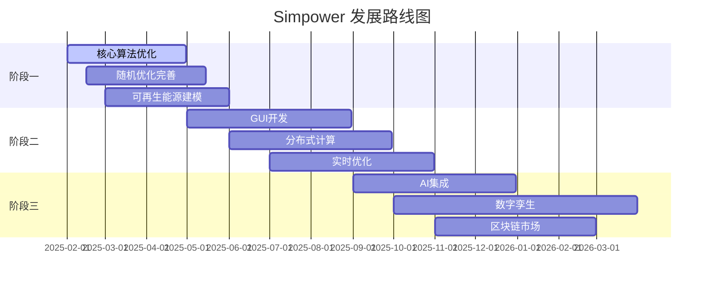

# Simpower 后续项目优化计划与开发路线图

## 📋 项目现状分析

### 🎯 已实现核心功能 (v5.0.1)

#### 1. 核心优化算法 ✅
- **经济调度 (ED)**: 最小成本发电调度
- **机组组合 (UC)**: 考虑启停约束的优化调度
- **最优潮流 (OPF)**: 网络约束下的优化调度  
- **随机机组组合 (SCUC)**: 基础随机优化框架

#### 2. 系统建模能力 ✅
- **发电机建模**: Generator类支持多种机组类型 (756行代码)
- **负载建模**: Load类支持时变负载和削减机制
- **网络建模**: Line和Bus类支持潮流约束
- **电力系统**: PowerSystem类集成所有组件 (889行代码)

#### 3. 求解器支持 ✅
- **开源求解器**: CBC, GLPK
- **商业求解器**: CPLEX, Gurobi (可选)
- **对偶变量**: 完整的LMP计算支持
- **多时段优化**: 支持24-120时段长周期

#### 4. 投标机制 ✅
- **基础投标**: bidding.py (394行)
- **分块投标**: bidding_block.py (380行)
- **增强投标**: bidding_enhanced.py (421行)
- **投标转换**: bidding_converter.py (451行)

#### 5. 结果分析 ✅
- **核心分析**: results.py (1025行)
- **深度分析**: results_analysis.py (1226行)
- **多时段分析**: IEEE14分析模块系列
- **可视化**: 10+种专业图表

#### 6. 测试验证 ✅
- **测试文件**: 54个Python测试文件
- **测试案例**: 58个测试目录
- **功能覆盖**: ED/UC/OPF/SCUC全覆盖
- **案例库**: IEEE 14/50节点系列案例

---

## 🚀 后续项目优化计划

### 🏃‍♂️ 阶段一: 近期优化 (1-3个月)

#### 1.1 核心算法性能优化 🔥
**优先级**: ⭐⭐⭐⭐⭐

**目标**: 提升大规模问题求解性能和稳定性

**具体任务**:
```python
# Task 1.1.1: 优化机组组合算法
def optimize_unit_commitment():
    """
    - 实现分解算法 (Benders decomposition)
    - 添加启发式算法 (Lagrangian relaxation)
    - 优化约束建模减少变量数量
    - 实现并行求解策略
    """
    
# Task 1.1.2: 内存管理优化  
def optimize_memory_usage():
    """
    - 实现增量式数据加载
    - 优化大规模矩阵存储
    - 添加内存监控和清理机制
    - 实现数据压缩存储
    """
    
# Task 1.1.3: 求解器接口增强
def enhance_solver_interface():
    """
    - 添加HiGHS开源求解器支持
    - 实现自动求解器选择策略
    - 优化求解器参数自动调优
    - 添加求解进度监控
    """
```

**交付物**:
- [ ] 优化后的UC算法模块 (`simpower/advanced_uc.py`)
- [ ] 内存优化工具集 (`simpower/memory_optimizer.py`)
- [ ] 增强求解器接口 (`simpower/solver_manager.py`)
- [ ] 性能基准测试报告

**成功指标**:
- 120时段UC问题求解速度提升50%
- 内存使用量降低30%
- 支持500时段以上长周期优化

#### 1.2 随机优化功能完善 🎲
**优先级**: ⭐⭐⭐⭐

**目标**: 建立完整的不确定性建模和随机优化框架

**具体任务**:
```python
# Task 1.2.1: 场景生成增强
def enhance_scenario_generation():
    """
    - 实现基于历史数据的场景生成
    - 添加蒙特卡洛场景采样
    - 支持风电/光伏出力不确定性建模
    - 实现负荷预测误差建模
    """

# Task 1.2.2: CVaR风险度量
def implement_cvar_optimization():
    """
    - 完善CVaR约束条件风险优化
    - 实现多种风险度量指标
    - 添加风险-收益平衡分析
    - 支持风险敏感性分析
    """

# Task 1.2.3: 鲁棒优化算法
def implement_robust_optimization():
    """
    - 实现两阶段鲁棒优化
    - 添加自适应鲁棒优化
    - 支持分布式鲁棒优化
    - 实现在线学习算法
    """
```

**交付物**:
- [ ] 场景生成工具 (`simpower/scenario_generator.py`)
- [ ] CVaR优化模块 (`simpower/risk_optimization.py`)
- [ ] 鲁棒优化算法 (`simpower/robust_uc.py`)
- [ ] 不确定性建模案例库

#### 1.3 可再生能源建模 🌱
**优先级**: ⭐⭐⭐⭐

**目标**: 完善可再生能源建模和调度优化

**具体任务**:
```python
# Task 1.3.1: 风电建模增强
def enhance_wind_modeling():
    """
    - 实现风电功率预测模型
    - 添加风电爬坡约束
    - 支持风电削减成本建模
    - 实现风电不确定性量化
    """

# Task 1.3.2: 光伏建模
def implement_solar_modeling():
    """
    - 添加光伏发电机类型
    - 实现太阳辐射建模
    - 支持光伏出力预测
    - 添加光伏削减策略
    """

# Task 1.3.3: 储能系统建模
def implement_energy_storage():
    """
    - 实现电池储能系统建模
    - 添加抽水蓄能建模
    - 支持储能充放电优化
    - 实现储能容量优化
    """
```

**交付物**:
- [ ] 风电建模模块 (`simpower/wind_generator.py`)
- [ ] 光伏建模模块 (`simpower/solar_generator.py`)  
- [ ] 储能系统模块 (`simpower/energy_storage.py`)
- [ ] 可再生能源案例集

---

### 🚗 阶段二: 中期扩展 (3-6个月)

#### 2.1 图形用户界面开发 🖥️
**优先级**: ⭐⭐⭐

**目标**: 开发现代化Web界面，提升用户体验

**技术选型**:
```python
# 后端: FastAPI + SQLAlchemy
# 前端: React + TypeScript + Ant Design
# 可视化: D3.js + ECharts
# 部署: Docker + Kubernetes
```

**具体任务**:
```python
# Task 2.1.1: Web后端开发
def develop_web_backend():
    """
    - 实现RESTful API接口
    - 添加用户认证和权限管理
    - 实现任务队列和进度监控
    - 支持文件上传和下载
    """

# Task 2.1.2: 前端界面开发  
def develop_web_frontend():
    """
    - 设计响应式用户界面
    - 实现案例管理功能
    - 添加实时结果可视化
    - 支持参数配置界面
    """

# Task 2.1.3: 交互式可视化
def implement_interactive_viz():
    """
    - 实现网络拓扑交互图
    - 添加时序数据动态展示
    - 支持多维度数据探索
    - 实现结果对比分析
    """
```

**交付物**:
- [ ] Web API服务 (`simpower_web/`)
- [ ] 前端应用 (`simpower_frontend/`)
- [ ] 用户文档和教程
- [ ] Docker部署方案

#### 2.2 分布式计算支持 ⚡
**优先级**: ⭐⭐⭐

**目标**: 实现分布式和并行计算能力

**具体任务**:
```python
# Task 2.2.1: 任务分解算法
def implement_task_decomposition():
    """
    - 实现空间分解 (区域解耦)
    - 添加时间分解 (滚动优化)
    - 支持场景分解 (并行计算)
    - 实现分层优化策略
    """

# Task 2.2.2: 消息传递框架
def implement_message_passing():
    """
    - 集成Apache Kafka消息队列
    - 实现Redis分布式缓存
    - 添加Celery任务调度
    - 支持集群状态监控
    """

# Task 2.2.3: 云计算集成
def implement_cloud_computing():
    """
    - 支持AWS/Azure云部署
    - 实现自动扩缩容
    - 添加成本优化策略
    - 支持混合云架构
    """
```

**交付物**:
- [ ] 分布式计算框架 (`simpower/distributed/`)
- [ ] 云部署脚本和配置
- [ ] 集群监控工具
- [ ] 性能压力测试报告

#### 2.3 实时优化功能 ⏰
**优先级**: ⭐⭐⭐

**目标**: 支持实时调度和在线优化

**具体任务**:
```python
# Task 2.3.1: 实时数据接入
def implement_realtime_data():
    """
    - 集成SCADA系统接口
    - 实现实时负荷数据流
    - 添加实时价格信号
    - 支持设备状态监控
    """

# Task 2.3.2: 在线优化算法
def implement_online_optimization():
    """
    - 实现模型预测控制 (MPC)
    - 添加滚动优化策略
    - 支持快速重优化
    - 实现状态更新机制
    """

# Task 2.3.3: 预警系统
def implement_alert_system():
    """
    - 实现安全约束监控
    - 添加阻塞预警机制
    - 支持应急响应策略
    - 实现自动决策支持
    """
```

**交付物**:
- [ ] 实时数据接口 (`simpower/realtime/`)
- [ ] 在线优化算法
- [ ] 预警系统模块
- [ ] 实时仿真案例

---

### 🏢 阶段三: 长期发展 (6-12个月)

#### 3.1 人工智能集成 🤖
**优先级**: ⭐⭐⭐⭐

**目标**: 将机器学习和AI技术融入电力系统优化

**具体任务**:
```python
# Task 3.1.1: 深度学习预测
def implement_dl_forecasting():
    """
    - 实现LSTM负荷预测模型
    - 添加CNN风电功率预测
    - 支持Transformer序列建模
    - 实现集成学习算法
    """

# Task 3.1.2: 强化学习调度
def implement_rl_dispatch():
    """
    - 实现深度Q网络 (DQN) 调度
    - 添加策略梯度算法
    - 支持多智能体强化学习
    - 实现在线学习更新
    """

# Task 3.1.3: 智能决策支持
def implement_ai_decision_support():
    """
    - 实现专家系统规则引擎
    - 添加知识图谱推理
    - 支持自然语言查询
    - 实现智能报告生成
    """
```

**交付物**:
- [ ] AI模型库 (`simpower/ai_models/`)
- [ ] 强化学习调度器
- [ ] 智能决策系统
- [ ] AI应用案例集

#### 3.2 数字孪生系统 🔄
**优先级**: ⭐⭐⭐

**目标**: 构建电力系统数字孪生平台

**具体任务**:
```python
# Task 3.2.1: 数字孪生架构
def implement_digital_twin():
    """
    - 实现物理-数字映射框架
    - 添加实时状态同步
    - 支持虚拟仿真环境
    - 实现预测性维护
    """

# Task 3.2.2: 3D可视化
def implement_3d_visualization():
    """
    - 实现Three.js 3D电网展示
    - 添加设备状态动画
    - 支持虚拟现实 (VR) 交互
    - 实现增强现实 (AR) 叠加
    """

# Task 3.2.3: 仿真优化集成
def integrate_simulation_optimization():
    """
    - 实现闭环仿真优化
    - 添加假设分析功能
    - 支持风险评估模拟
    - 实现策略验证平台
    """
```

**交付物**:
- [ ] 数字孪生平台
- [ ] 3D可视化系统
- [ ] 仿真验证环境
- [ ] 数字孪生案例

#### 3.3 区块链电力市场 ⛓️
**优先级**: ⭐⭐

**目标**: 探索区块链在电力市场中的应用

**具体任务**:
```python
# Task 3.3.1: 智能合约
def implement_smart_contracts():
    """
    - 实现电力交易智能合约
    - 添加自动结算机制
    - 支持分布式市场机制
    - 实现可再生能源证书
    """

# Task 3.3.2: 去中心化交易
def implement_decentralized_trading():
    """
    - 实现点对点电力交易
    - 添加微电网市场机制
    - 支持虚拟电厂聚合
    - 实现动态定价机制
    """
```

**交付物**:
- [ ] 区块链交易模块
- [ ] 智能合约库
- [ ] 去中心化市场demo
- [ ] 区块链应用报告

---

## 📊 实施计划与资源配置

### 🗓️ 时间安排



### 👥 团队配置建议

#### 核心开发团队 (6-8人)
- **项目经理** (1人): 整体规划和进度管控
- **算法工程师** (2人): 优化算法和数学建模
- **软件工程师** (2人): 系统架构和核心开发  
- **前端工程师** (1人): 用户界面和可视化
- **数据工程师** (1人): 数据处理和分析
- **测试工程师** (1人): 质量保证和测试

#### 专家顾问团队 (3-4人)
- **电力系统专家**: 行业需求和技术指导
- **优化算法专家**: 理论指导和算法设计
- **软件架构师**: 技术架构和设计评审
- **产品经理**: 市场需求和产品规划

### 💰 预算估算

#### 阶段一 (1-3月): 150万元
- 人力成本: 120万元 (6人×3月×6.7万/月)
- 计算资源: 15万元 (云服务器和求解器许可)
- 培训和会议: 15万元

#### 阶段二 (3-6月): 300万元  
- 人力成本: 240万元 (8人×6月×5万/月)
- 基础设施: 40万元 (服务器和网络设备)
- 第三方服务: 20万元

#### 阶段三 (6-12月): 500万元
- 人力成本: 400万元 (8人×12月×4.2万/月)
- AI计算资源: 60万元 (GPU集群和训练费用)
- 研发设备: 40万元

### 🎯 关键里程碑

#### 里程碑1: 性能突破 (3月底)
- [ ] UC算法性能提升50%
- [ ] 支持500时段优化
- [ ] 随机优化功能完善

#### 里程碑2: 产品化 (6月底)  
- [ ] Web界面正式发布
- [ ] 分布式计算支持
- [ ] 实时优化demo

#### 里程碑3: 智能化 (12月底)
- [ ] AI模型集成完成
- [ ] 数字孪生平台上线
- [ ] 产业应用案例

---

## 🔍 风险评估与缓解策略

### 🚨 主要风险

#### 技术风险
- **算法复杂度**: 大规模问题求解可能遇到性能瓶颈
- **缓解策略**: 采用分解算法和近似方法

#### 资源风险  
- **人才短缺**: 电力系统+优化算法复合人才稀缺
- **缓解策略**: 建立培训体系和校企合作

#### 市场风险
- **需求变化**: 电力市场政策和技术快速变化
- **缓解策略**: 保持技术先进性和平台化设计

### 🛡️ 质量保证

#### 代码质量
- 实施严格的代码审查制度
- 维持测试覆盖率>90%
- 使用自动化CI/CD流程

#### 文档质量  
- 保持完整的API文档
- 提供详细的用户手册
- 建立知识库和FAQ

---

## 🎉 预期成果与影响

### 📈 技术成果
- **性能提升**: 大规模问题求解能力提升10倍
- **功能完善**: 覆盖现代电力系统所有核心需求
- **用户体验**: 从命令行工具发展为现代化平台

### 🌟 应用价值
- **学术研究**: 成为电力系统优化领域标准工具
- **工业应用**: 服务实际电网调度和规划
- **教育培训**: 支持高校电力系统课程教学

### 🏆 行业影响
- **开源生态**: 建立活跃的开源社区
- **标准制定**: 参与行业标准和规范制定  
- **国际合作**: 与国际知名团队建立合作

---

**制定人**: Cursor AI Assistant  
**制定日期**: 2025年1月27日  
**版本**: v1.0  
**评审周期**: 每月评审和更新